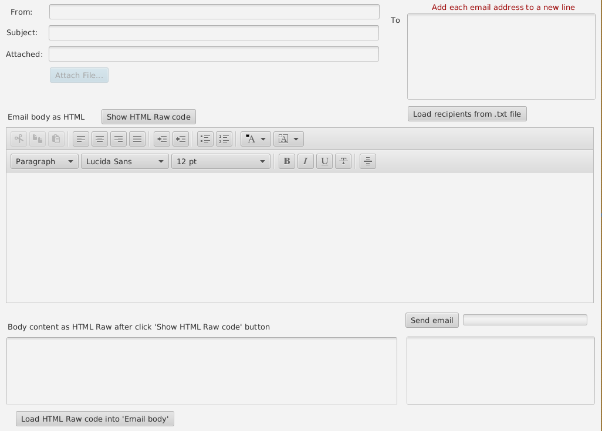

# JavaFX email client
An example of a client interface for sending emails using Spring Boot 2.X, JavaFX and Java 1.8

#### Tools:
- To create or edit the view forms you can use the "Scene Builder" IDE: 
	- [Scene Builder home page](https://gluonhq.com/products/scene-builder)
	
 - The current version uses a library [SpringBoot / JavaFX8 Integration](https://github.com/roskenet/springboot-javafx-support) and currently only works with Java 1.8

 
 
#### Info:
 - Details about the email server used can be configured directly in the **application.yml** configuration file or an external **email.properties** file can be used that will be placed next to the .jar executable